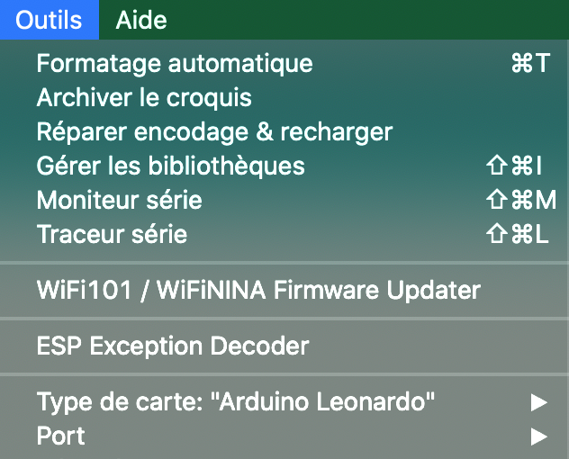

# soundboard

## Présentation
Ce projet a pour but d'ajouter des raccourcis clavier facilement.

## Installation
Pour réécrire le code fourni, il est nécessaire d'installer l'IDE Arduino [trouvable ici](https://www.arduino.cc/).

Une fois Arduino installé et lancé, ouvrir le fichier [soundBoard.ino](./soundBoard/soundBoard.ino).

Il est maintenant possible de modifier et charger le code.

Pensez à configurer le microcontrôleur dans le menu outils:

Définir le Type de carte sur Arduino Leonardo, et le Port sur le port où est branché la carte.

Une fois les modifications faites, téléverser le code:

And voilà ! :)
